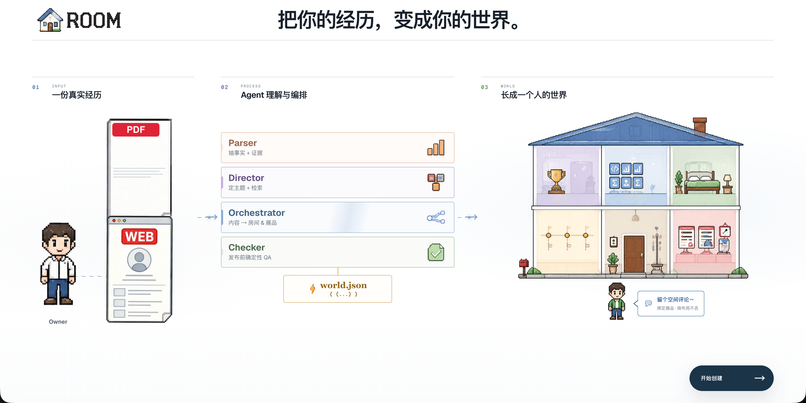
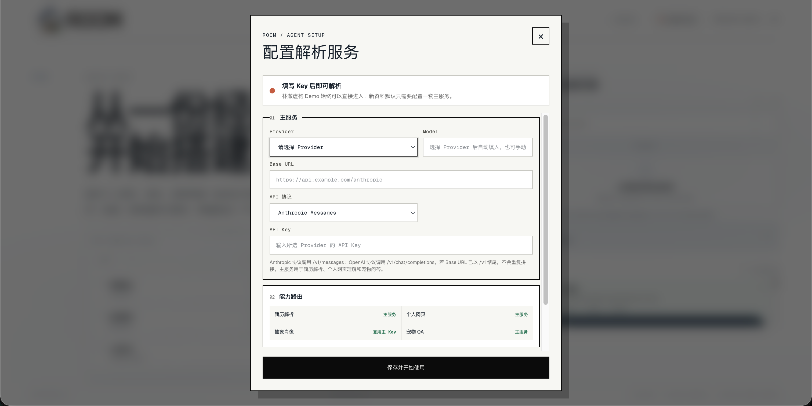
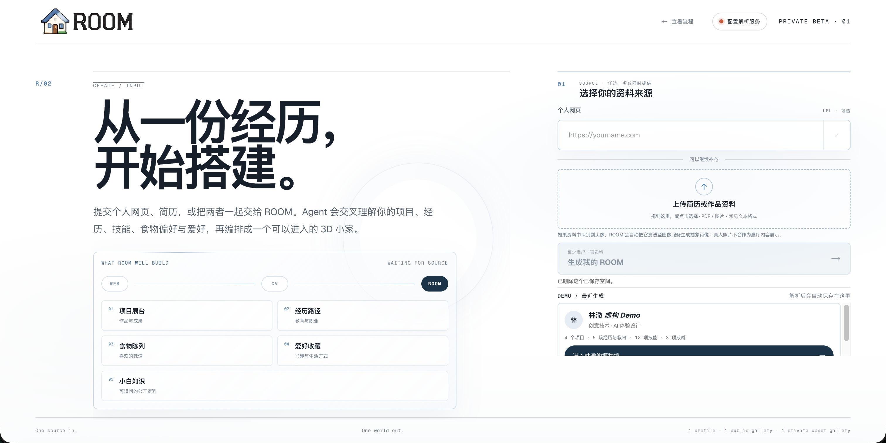
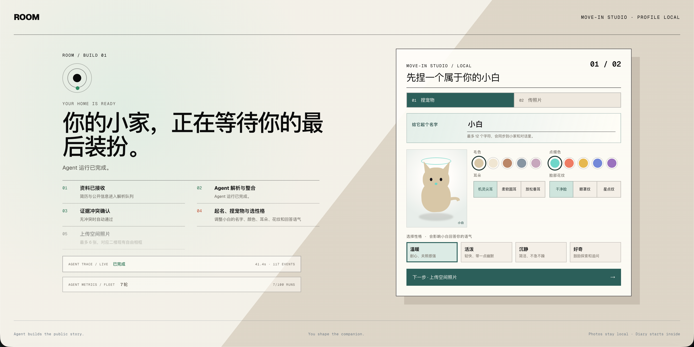
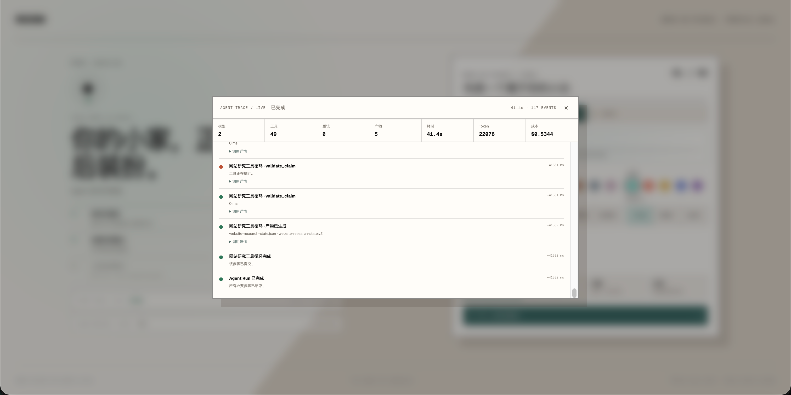

# ROOM

[](https://github.com/hanshenmesen/ROOM/actions/workflows/ci.yml)

**English** | [简体中文](./README.zh-CN.md)

> Turn a portfolio into a world people can walk through.

ROOM converts a résumé or public portfolio into an evidence-backed, explorable two-floor 3D home. LLMs handle semantic extraction and bounded planning; deterministic code owns validation, conflict review, world compilation, safety checks, persistence boundaries, and rendering.

## Product gallery

### 1. From experience to world

Import a résumé or public portfolio, let the Agent pipeline extract and organize evidence, and compile the result into an explorable 3D home.



### 2. Visitor-configured Provider

Visitors can configure their own Provider, model, Base URL, API protocol, and API Key, with capability routing shown before use.



### 3. Source intake

Start with a personal website, upload a résumé or portfolio file, or reopen a recently generated demo.



### 4. Move-in customization

After the Agent run completes, review the build status and customize the companion and local room photos before entering the world.



### 5. Agent Trace

Inspect redacted model and tool events together with retries, artifacts, latency, token usage, and estimated cost.



## What you can do

- Import résumé text, PDF, image, Markdown, or a public portfolio URL.
- Extract identity, experience, education, projects, skills, achievements, interests, contacts, and source evidence.
- Research a personal website through a bounded same-host Tool Agent.
- Review conflicting or unsupported claims before publishing them.
- Compile the validated profile into a navigable Mardou museum with project islands, exhibits, a source archive, and a private upper gallery.
- Inspect redacted Agent traces, retries, token usage, latency, artifacts, and estimated cost.
- Ask the roaming companion profile-grounded questions with verified citations and optional realtime speech.
- Enter the built-in fictional Lin Che world without configuring an API key.

## Quick start

Requirements: Node.js `>=22.13.0` and npm.

```bash
npm install
npm run dev
```

Open [http://localhost:3000](http://localhost:3000).

- Choose the fictional demo to explore immediately without model calls.
- For a real résumé or portfolio, open **配置解析服务** and configure a Provider.
- Run `npm test` before publishing a change; it includes layout and asset audits, unit/security tests, a production build, and rendered-shell checks.

## Model Provider configuration

ROOM supports two configuration paths. A browser session configuration takes precedence for that visitor's requests; otherwise the server uses environment variables.

### Visitor-configured Provider

Choose **自定义 Provider** in the setup dialog and provide:

| Field | Meaning |
| --- | --- |
| API protocol | `Anthropic Messages` or `OpenAI Chat Completions` |
| Base URL | Public HTTPS Provider root; `/v1` may already be present |
| Model | Exact upstream model identifier |
| API Key | Credential for that Provider |
| Authentication | `Authorization: Bearer` or `api-key` for OpenAI-compatible gateways |
| `x-maas-user-email` | Optional fixed enterprise-audit value |
| `x-maas-app-id` | Optional fixed application identifier |

ROOM appends `/v1/messages` for Anthropic Messages and `/v1/chat/completions` for OpenAI Chat Completions. It does not duplicate `/v1`, and it does not accept arbitrary visitor-defined Header names.

Visitor values are stored only in the current tab's `sessionStorage`; they are not written to the repository or `localStorage`. They are sent through the ROOM server because the server performs the upstream model request. Only use this mode on a deployment you trust: its operator can technically observe credentials in transit.

Visitor Provider URLs must be publicly resolvable HTTPS endpoints. URL, redirect, and DNS checks reject loopback, private, link-local, reserved, credential-bearing, and otherwise unsafe destinations. A private-only gateway requires a deployment-controlled integration rather than an arbitrary visitor URL.

### Server-configured Provider

Copy the tracked template and keep real values in the untracked local environment file:

```bash
cp .env.example .env.local
```

Minimal primary configuration:

```dotenv
MAAS_API_KEY=your-primary-key
MAAS_BASE_URL=https://api.deepseek.com/anthropic
MAAS_MODEL=deepseek-v4-pro
```

Optional slots are available for:

- `WEBSITE_AGENT_*`: independent concurrent personal-website processing; defaults to the public DashScope Anthropic-compatible endpoint and `qwen3.5-plus` when enabled with a key.
- `IMAGE_MAAS_*`: abstract portrait generation.
- `PET_QA_*`: companion question answering.
- `NEXT_PUBLIC_PET_TTS_*`: optional browser-visible realtime speech settings; never place credentials in these variables.
- `INTERNAL_MAAS_*`, `EXTERNAL_MAAS_*`, and `*_USER_EMAIL`: deployment-specific gateway presets and audit Headers.

See [.env.example](./.env.example) for the complete contract. Internal hostnames, model identifiers, App IDs, and credentials are intentionally absent from tracked defaults. Production deployments should configure the same values as platform secrets rather than shipping `.env.local`.

### Provider capability and compatibility notes

| Provider route | Structured output | PDF/image behavior |
| --- | --- | --- |
| DeepSeek official Anthropic endpoint | Tool Use; thinking explicitly disabled | Text only; PDFs use locally extracted, line-numbered text; images are unsupported |
| Generic Anthropic-compatible route | Tool Use or JSON Schema, depending on mode | Native PDF/image blocks are used; the selected model must actually support them |
| Visitor OpenAI-compatible route | Function Calling | Conservatively treated as text only; PDFs use locally extracted text |
| Deployment-configured internal MAAS | Function Calling with fixed MAAS Headers | Text only unless a reviewed capability row says otherwise |

Text and Markdown work across all routes. A scanned PDF without a text layer requires a Provider that supports native PDF or image input.

Provider protocol compatibility is not the same as schema compliance. Some OpenAI-compatible Qwen deployments accept the request and return `tool_calls`, but encode nested objects and arrays as JSON strings. ROOM deliberately rejects that response as `invalid_structure`; after bounded repair attempts the parse request returns HTTP 502. This is not an API Key or Base URL failure. Use a model verified against ROOM's nested tool schema, or add a reviewed compatibility adapter that parses and then fully revalidates the result.

Server-side Provider targets can be checked without making calls:

```bash
npm run smoke:provider
```

Run the real, billable compatibility smoke only when intended:

```bash
npm run smoke:provider -- --allow-model-calls
```

The smoke test reports per-target schema compatibility, latency, token usage, and structural diagnostics. Browser-only session settings are not read by this CLI.

## Capability routing

| Capability | Default route |
| --- | --- |
| Résumé and portfolio extraction | Primary Provider |
| Personal website enrichment | Primary Provider, or an optional independent Website Agent |
| Abstract portrait | Dedicated image slot, falling back to the primary key where supported |
| Companion QA | Dedicated Pet QA slot, falling back to the primary Provider |
| Companion speech | Optional browser-side realtime TTS endpoint, then browser voice fallback |

When the identity shard finds a personal homepage, ROOM starts bounded website preparation while the remaining résumé extraction continues. The model planner may select only exact policy-approved, same-host URLs; invalid plans fall back to deterministic ranking.

## How the pipeline works

```text
Résumé / PDF / public portfolio
        ↓
Source preparation + safety limits
        ↓
Identity and inventory Agents ─────→ bounded Website Research Agent
        ↓                                      ↓
        └──────── evidence-backed profile merge
                               ↓
                    human conflict checkpoint
                               ↓
                       validated profile.v1
                               ↓
       license-aware Creative Retrieval + deterministic compiler
                               ↓
                         validated world.v1
                               ↓
                 Three.js runtime + grounded QA
```

Raw model output never reaches the renderer. Each model result must pass structural validation, source-grounding validation, normalization, and deterministic merge rules before it becomes a versioned artifact. Grounding proves provenance to the submitted résumé or inspected portfolio; ROOM does not independently verify whether those source statements are true. See [Agent architecture](./docs/ARCHITECTURE.md) and the [hybrid Agent boundary ADR](./docs/adr/0001-hybrid-agent-boundary.md).

## Product and runtime highlights

### Agent system

- Parallel identity and inventory extraction with bounded repair and fallback loops.
- Page-aware PDF preprocessing and line/page evidence locators.
- Plan → Tool → Observation → Replan website research with same-host and navigation budgets.
- Source-grounded claim merging and explicit user review for high-risk source conflicts.
- Cancellation, shared token/cost/time budgets, circuit breaking, bounded backoff, and concurrency leases.
- Redacted per-run traces and cross-run metrics for model calls, tools, retries, latency, tokens, and estimated cost.

### 3D home

- React Three Fiber Mardou museum with first-person WASD navigation, collision handling, camera routes, and a clickable staircase.
- Public project islands, profile exhibits, source archive, editable presentation fields, and exhibit-focus screens.
- Browser-local private gallery and diary boundary.
- Procedural companion, grounded QA, verified citations, realtime TTS streaming, and browser speech fallback.
- Abstract portrait generation, local background music, loading/error resilience, mobile composition checks, and asset budgets.

### Creative Retrieval

ROOM currently uses bilingual lexical expansion, metadata filtering, weighted reranking, and a strict License Guard over a curated reference catalog. It is not currently semantic/vector RAG. Vector retrieval remains gated on at least 200 curated references plus a measured lexical Recall regression. See [Creative Retrieval](./docs/CREATIVE_RETRIEVAL.md).

## Security and privacy boundaries

- Résumé text, portfolio HTML, links, model output, Tool output, questions, and visitor Provider settings are untrusted input.
- Public-web requests validate URL syntax, every redirect, and resolved A/AAAA addresses before fetching.
- Source-authored Prompt Injection is quarantined while preserving evidence line numbers.
- Trace storage excludes prompts, source bodies, API keys, Authorization Headers, cookies, and full model payloads.
- Companion context is built from an explicit public-profile allowlist; citations are checked against real Profile evidence.
- Browser Provider settings never reveal server-side keys, but the ROOM proxy necessarily receives visitor credentials.
- Diagnostic payload dumping is local-only and disabled by default because it may contain résumé or model-output data.

See [Agent security](./docs/AGENT_SECURITY.md) for the threat model, limits, residual DNS risk, and red-team coverage.

## Workflow persistence

The default Workflow Store is bounded and in-memory. It supports retries, cancellation, checkpoints, review interrupts, and resume within one running process, but it does not survive a restart.

A D1 metadata + private R2 body implementation is available and selected automatically when `DB` and `WORKFLOW_OBJECTS` bindings exist. The checked-in [.openai/hosting.json](./.openai/hosting.json) does not currently provision those resources, so durable recovery is not enabled by default. Production enablement also requires ownership authorization and scheduled retention cleanup. See [Workflow state](./docs/WORKFLOW_STATE.md).

## Development commands

| Command | Purpose |
| --- | --- |
| `npm run dev` | Start the local vinext development server |
| `npm run typecheck` | Run TypeScript without emitting files |
| `npm run lint` | Run ESLint |
| `npm test` | Run audits, all tests, production build, and rendered HTML checks |
| `npm run build` | Create a production vinext build |
| `npm run asset:audit` | Check the Mardou GLB against the asset budget |
| `npm run baseline:agent` | Verify the deterministic Agent pipeline baseline |
| `npm run eval:profile` | Run the offline Profile Eval |
| `npm run eval:full` | Run the full Profile Eval dataset |
| `npm run eval:creative` | Evaluate retrieval Recall, Precision, nDCG, citations, and license violations |
| `npm run eval:judge` | Run LLM Judge calibration fixtures |
| `npm run rag:sync` | Refresh the compact local reference corpus |
| `npm run smoke:provider` | Inspect configured real-Provider targets without calling them |

Real Provider calls and Eval experiments can cost money. Scripts that permit them require explicit flags or credentials; inspect their output target before running them in CI.

## Repository map

```text
app/                    Pages and API routes
components/             Product UI, 3D runtime, Agent trace, and review panels
lib/agent-runtime/      Budgets, tracing, cancellation, metrics, and redaction
lib/agents/             Profile, website, portrait, and QA model boundaries
lib/workflow/           Checkpointed Run state and in-memory/D1/R2 stores
lib/rag/                Creative Retrieval and license-aware ranking
schemas/                Profile, world, and checker contracts
evals/                  Offline datasets, fixtures, baselines, and reports
research/rag/           Curated reference metadata
public/vendor/          Audited third-party 3D assets and licenses
scripts/                Audits, Evals, smoke checks, and maintenance tools
tests/                  Unit, integration, rendering, and security tests
docs/                   Architecture, product, security, workflow, and ADRs
```

Useful starting points:

- [Product definition](./docs/PRODUCT.md)
- [Architecture](./docs/ARCHITECTURE.md)
- [Website Research Agent](./docs/WEBSITE_RESEARCH_AGENT.md)
- [Observability](./docs/AGENT_OBSERVABILITY.md)
- [Eval report](./docs/AGENT_EVAL_REPORT.md)
- [Profile conflict review](./docs/PROFILE_CONFLICT_REVIEW.md)
- [Roadmap](./docs/ROADMAP.md)
- [Contributing](./CONTRIBUTING.md)

## Current status and limitations

ROOM is a runnable research/demo system, not a production multi-tenant service.

- The fictional world and local development flow are ready to run.
- Real model quality depends on the selected Provider's Tool/JSON Schema behavior, not just endpoint compatibility.
- Durable D1/R2 recovery is implemented but not provisioned by default.
- Accounts, production ownership controls, persistent public comments, racing navigation, and generative Blender asset creation are outside the current release.
- Reference implementations and assets must remain quarantined until license and provenance checks permit reuse.

## License

A repository-wide license has not yet been selected. Third-party assets retain their documented licenses under `public/vendor/`; do not copy external code or assets into ROOM without a completed license audit.
