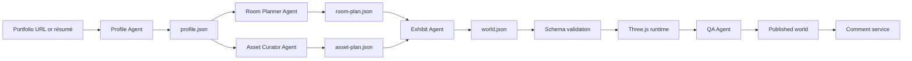

# Architecture

## Architectural decision

ROOM uses agents for ambiguous semantic work and deterministic software for rendering, storage, validation, and publishing.

All agent boundaries use versioned JSON Schema contracts. An agent cannot directly mutate another agent's output or edit the renderer.

## Pipeline

## Agent contracts

### 1. Template Scout Agent

Input:

- search scope
- approved sources
- license policy
- target capabilities

Output:

- repository/site URL
- screenshots or visual notes
- interaction patterns
- technical stack
- reusable architectural ideas
- license and attribution status
- risk flags

It updates the reference catalog, not the production asset library.

### 2. Profile Agent

Input:

- public URL, PDF, or user text

Output:

- facts mapped to a résumé schema
- source URL or page reference for each fact
- confidence score
- missing and conflicting information
- candidate media assets

The owner must confirm low-confidence or sensitive information.

### 3. Room Planner Agent

Input:

- confirmed profile
- selected theme
- room and performance limits

Output:

- connected room graph
- semantic purpose of each room
- exhibit allocation
- portal placement constraints
- guided tour order

It does not select concrete 3D models.

### 4. Asset Curator Agent

Input:

- room plan
- approved asset catalog
- visual direction
- device budget

Output:

- asset IDs only
- scale and style variants
- required compression or LOD level
- attribution records
- missing asset requests

It cannot select assets with unknown or incompatible licenses for production.

### 5. Exhibit Agent

Input:

- profile
- room plan
- asset plan

Output:

- exhibit text
- object bindings
- interaction type
- accessible HTML fallback
- comment anchor IDs
- external links

It may shorten copy but cannot invent achievements.

### 6. QA Agent

Input:

- compiled world
- source profile
- runtime metrics

Output:

- factual mismatch report
- unreachable portal/exhibit report
- performance violations
- mobile and keyboard-navigation failures
- broken links
- publish recommendation

## Deterministic services

### World compiler

Validates `world.json`, resolves approved assets, and builds runtime scene objects.

### Room runtime

Responsibilities:

- room streaming and lazy loading
- portal transitions
- first-person and guided navigation
- collision
- interaction raycasting
- HTML overlays and accessible views
- adaptive rendering quality

Each room should be separately loadable. The initial lobby must not require downloading every room.

### Comment service

Stores comments against stable semantic IDs, provides moderation, and pushes approved updates to connected visitors.

### Asset registry

Every asset record must contain:

- stable asset ID
- source
- license
- attribution requirements
- content hash
- polygon count
- texture memory estimate
- bounding box
- supported LODs
- allowed use status

## Collaboration boundaries

Recommended ownership:

| Module | Primary responsibility |
| --- | --- |
| `apps/studio` | résumé intake, preview, owner editing |
| `apps/world` | visitor runtime |
| `packages/schemas` | all shared contracts |
| `packages/agents` | agent implementations |
| `packages/world-runtime` | Three.js compilation and navigation |
| `packages/asset-registry` | approved assets and metadata |
| `packages/comments` | comment client and moderation |
| `packages/qa` | automated quality gates |

No implementation module may depend on raw model output. It must depend on validated schema objects.
