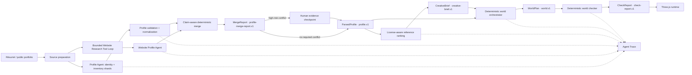

# ROOM Agent Architecture

## Architectural decision

ROOM is a hybrid Agent system. LLM Agents handle ambiguous semantic extraction; deterministic software owns validation, reference ranking, world compilation, safety checks, storage, and rendering.

Every boundary after a model call uses a validated, versioned artifact. Raw model output never reaches the renderer or mutates another step's artifact directly.

## Current pipeline

## LLM Agent boundaries

### Profile Agent

The Profile Agent runs evidence-backed identity and inventory shards. It may choose between configured providers, modes, models, and bounded repair attempts. Its output must pass structural validation and profile normalization before becoming `ParsedProfile`.

### Website Profile Agent

The Website Research Agent is a hybrid Tool Agent. A deterministic control plane compares the current Profile with missing-field rules, ranks same-host links, and runs bounded `fetch_page`, `list_links`, `inspect_page`, `extract_media`, `validate_claim`, and `submit_profile` tools. The semantic Profile Agent sees only the inspected, size-bounded page corpus and must produce evidence-backed output. It never chooses an arbitrary tool name or bypasses URL policy.

Résumé parsing preserves early concurrency: once the Identity shard discovers a personal homepage, ROOM prefetches only its root page. Additional pages are selected after the complete résumé Profile reveals which fields are missing. A website-only intake goes directly through the same multi-page loop. See [Website Research Agent](./WEBSITE_RESEARCH_AGENT.md).

### Bounded generative features

Portrait art generation and companion Q&A call models, but they are not pipeline-planning Agents. Portrait output is a replaceable media artifact. Companion answers are bounded to the validated profile and must use verified citations.

## Deterministic services

- **Source preparation:** upload limits, URL safety, PDF pre-parsing, media extraction, and source labeling.
- **Profile validation and merge:** evidence-backed Claims, schema checks, deduplication, explicit source decisions, conflict detection, and user-confirmed locks. String length is not a confidence proxy.
- **Human Review:** exposes both candidate values and their source excerpts for high-risk conflicts. User decisions are recorded as `extractionMethod: "user"` / `origin: "user-confirmed"` and cannot be overwritten by a later Agent merge.
- **Creative Retrieval:** bilingual lexical recall, metadata filtering, weighted reranking, and a purpose-specific License Guard over a curated reference catalog. This is not currently semantic RAG or an LLM Agent; vector retrieval is gated on catalog scale and measured Recall. See [Creative Retrieval](./CREATIVE_RETRIEVAL.md).
- **World Orchestrator:** maps validated profile content and a creative brief into stable rooms, exhibits, surfaces, and interactions.
- **World Checker:** detects content omissions, overlap, dead interactions, navigation issues, and performance-budget violations.
- **Room runtime:** Three.js rendering, loading, collision, navigation, focus transitions, accessible presentation, and local customization.

Deterministic geometry and validation remain deterministic even if future Agent frameworks are introduced.

## Artifact contracts

Persisted baselines and future checkpoints use `VersionedArtifactEnvelope<T>` with these current versions:

| Artifact | Version |
| --- | --- |
| Parsed profile | `profile.v1` |
| Profile merge report | `profile-merge-report.v1` |
| Creative brief | `creative-brief.v1` |
| World plan | `world.v1` |
| Check report | `check-report.v1` |

Existing runtime and API payloads remain compatible. The envelope is applied at persistence, baseline, Eval, and future workflow-checkpoint boundaries. Unknown versions fail explicitly until a reviewed migration is added.

## Observability and privacy

Each model call has a unique call ID and records provider, model, mode, prompt version, latency, usage when supplied, attempt, and fallback count. Events are redacted before entering the Trace Store. API keys, Authorization headers, prompt bodies, and résumé bodies are not Trace fields.

Each Website Research tool call records a unique Tool Call ID, tool name, bounded parameter summary, output counts, latency, and a generic error code. Page bodies, Claim values, evidence excerpts, API keys, and request headers are excluded from Tool Trace.

The framework-neutral `RoomWorkflowEngine` records ordered events, node attempts, artifact-version checkpoints, cancellation, Idempotency Key reuse, review interrupts, and checkpoint resume. A node may return a `ProfileMergeReport`; required conflicts move the Run to `waiting_for_review`. Applying review decisions replaces only the Profile Artifact and resumes at the first incomplete node. Public Run snapshots expose Artifact metadata and only the evidence needed for an active review, never the source body or full Artifact body.

Profile model shards share one pre-call budget for model calls, estimated input tokens, reserved output tokens, estimated cost, and wall-clock duration. The same Run also shares a Provider circuit breaker and bounded backoff state. Incoming request cancellation is combined with Provider and webpage timeouts. Budget exhaustion is a redacted Trace event and cannot silently start another fallback call.

Untrusted source-authored instructions are quarantined before parsing and LLM submission while preserving source line numbers. Public-web requests validate URL syntax, every redirect, and resolved A/AAAA addresses. Companion citations are verified against actual Profile Item evidence, and Companion context is a public-field allowlist. See [Agent security](./AGENT_SECURITY.md).

The active `WorkflowStore` is intentionally in-memory because `.openai/hosting.json` has no D1 or R2 binding. It survives requests and browser refreshes handled by the same process or Worker isolate, but not process restarts, isolate replacement, or deployment. The D1 tables and migration are present as the durable metadata contract; enabling durable recovery still requires a D1/R2 store adapter, private object retention/deletion, and run ownership checks. See [Workflow state](./WORKFLOW_STATE.md).

## Decision records

- [ADR 0001: Hybrid Agent boundary](./adr/0001-hybrid-agent-boundary.md)
- [ADR 0002: Agent run persistence](./adr/0002-agent-run-persistence.md)
- [ADR 0003: Agent framework decision](./adr/0003-agent-framework-decision.md)
- [Agent security, reliability, and cost boundary](./AGENT_SECURITY.md)
- [ADR 0004: Creative Retrieval vector gate](./adr/0004-creative-retrieval-vector-gate.md)
