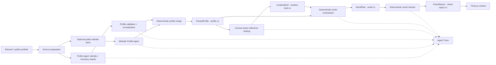

# ROOM Agent Architecture

## Architectural decision

ROOM is a hybrid Agent system. LLM Agents handle ambiguous semantic extraction; deterministic software owns validation, reference ranking, world compilation, safety checks, storage, and rendering.

Every boundary after a model call uses a validated, versioned artifact. Raw model output never reaches the renderer or mutates another step's artifact directly.

## Current pipeline

## LLM Agent boundaries

### Profile Agent

The Profile Agent runs evidence-backed identity and inventory shards. It may choose between configured providers, modes, models, and bounded repair attempts. Its output must pass structural validation and profile normalization before becoming `ParsedProfile`.

### Website Profile Agent

The current website path safely fetches one public page and applies the Profile Agent contract to its extracted content. It is not yet a multi-page Tool Agent; link selection, claim validation, and bounded research loops belong to the planned Website Research phase.

### Bounded generative features

Portrait art generation and companion Q&A call models, but they are not pipeline-planning Agents. Portrait output is a replaceable media artifact. Companion answers are bounded to the validated profile and must use verified citations.

## Deterministic services

- **Source preparation:** upload limits, URL safety, PDF pre-parsing, media extraction, and source labeling.
- **Profile validation and merge:** schema checks, evidence normalization, deduplication, and source precedence.
- **Creative Retrieval:** keyword and metadata ranking over a license-aware reference catalog. This is not currently semantic RAG or an LLM Agent.
- **World Orchestrator:** maps validated profile content and a creative brief into stable rooms, exhibits, surfaces, and interactions.
- **World Checker:** detects content omissions, overlap, dead interactions, navigation issues, and performance-budget violations.
- **Room runtime:** Three.js rendering, loading, collision, navigation, focus transitions, accessible presentation, and local customization.

Deterministic geometry and validation remain deterministic even if future Agent frameworks are introduced.

## Artifact contracts

Persisted baselines and future checkpoints use `VersionedArtifactEnvelope<T>` with these current versions:

| Artifact | Version |
| --- | --- |
| Parsed profile | `profile.v1` |
| Creative brief | `creative-brief.v1` |
| World plan | `world.v1` |
| Check report | `check-report.v1` |

Existing runtime and API payloads remain compatible. The envelope is applied at persistence, baseline, Eval, and future workflow-checkpoint boundaries. Unknown versions fail explicitly until a reviewed migration is added.

## Observability and privacy

Each model call has a unique call ID and records provider, model, mode, prompt version, latency, usage when supplied, attempt, and fallback count. Events are redacted before entering the Trace Store. API keys, Authorization headers, prompt bodies, and résumé bodies are not Trace fields.

Phase 3 adds a framework-neutral `RoomWorkflowEngine` around the deterministic Profile → Brief → World → Check path. The engine records ordered events, node attempts, artifact-version checkpoints, cancellation, Idempotency Key reuse, and checkpoint resume. Public Run snapshots expose artifact metadata but never the source body or artifact body.

The active `WorkflowStore` is intentionally in-memory because `.openai/hosting.json` has no D1 or R2 binding. It survives requests and browser refreshes handled by the same process or Worker isolate, but not process restarts, isolate replacement, or deployment. The D1 tables and migration are present as the durable metadata contract; enabling durable recovery still requires a D1/R2 store adapter, private object retention/deletion, and run ownership checks. See [Workflow state](./WORKFLOW_STATE.md).

## Decision records

- [ADR 0001: Hybrid Agent boundary](./adr/0001-hybrid-agent-boundary.md)
- [ADR 0002: Agent run persistence](./adr/0002-agent-run-persistence.md)
- [ADR 0003: Agent framework decision](./adr/0003-agent-framework-decision.md)
