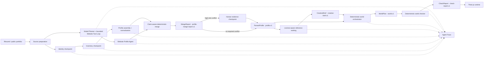

# ROOM Agent Architecture

## Architectural decision

ROOM is a hybrid Agent system. LLM Agents handle ambiguous semantic extraction; deterministic software owns validation, reference ranking, world compilation, safety checks, storage, and rendering.

Every boundary after a model call uses a structurally validated, source-grounded, versioned artifact. Raw model output never reaches the renderer or mutates another step's artifact directly. Source grounding only proves that a field came from the submitted résumé or an inspected portfolio page; ROOM treats those sources as user-provided truth and does not independently verify the real-world truth of a Claim.

## Current pipeline

## LLM Agent boundaries

### Profile Agent

The Profile Agent runs source-grounded identity and inventory shards as separate recoverable Workflow nodes. It may choose between configured providers, modes, models, and bounded repair attempts. Its output must pass structural validation and profile normalization before becoming `ParsedProfile`. This verifies provenance against the supplied source, not résumé authenticity.

### Website Profile Agent

The Website Research Agent is a hybrid Tool Agent. After each inspected page, a model planner receives a bounded Observation and chooses either an exact policy-approved candidate URL or `submit`. This creates a Plan→Tool→Observation→Replan loop without allowing the model to invent tool names, URLs, hosts, or budgets. Invalid output and Provider failure fall back to deterministic missing-field ranking. The control plane runs bounded `fetch_page`, `list_links`, `inspect_page`, `extract_media`, `validate_claim`, and `submit_profile` tools. Here `validate_claim` resolves locators and excerpts back to an inspected page; it does not fact-check the page. The semantic Profile Agent sees only the inspected, size-bounded page corpus and must produce source-grounded output.

Résumé parsing preserves early concurrency: once the Identity shard discovers a personal homepage, ROOM prefetches only its root page. Additional pages are selected after the complete résumé Profile reveals which fields are missing. A website-only intake goes directly through the same multi-page loop. See [Website Research Agent](./WEBSITE_RESEARCH_AGENT.md).

### Bounded generative features

Portrait art generation and companion Q&A call models, but they are not pipeline-planning Agents. Portrait output is a replaceable media artifact. Companion answers are bounded to the validated profile and must use verified citations.

## Deterministic services

- **Source preparation:** upload limits, URL safety, PDF pre-parsing, media extraction, and source labeling.
- **Profile validation and merge:** source-grounded Claims, schema checks, deduplication, explicit source decisions, conflict detection, and user-confirmed locks. It does not perform external truth verification. String length is not a confidence proxy.
- **Human Review:** exposes both candidate values and their source excerpts for high-risk conflicts. User decisions are recorded as `extractionMethod: "user"` / `origin: "user-confirmed"` and cannot be overwritten by a later Agent merge.
- **Creative Retrieval:** bilingual lexical recall, metadata filtering, weighted reranking, and a purpose-specific License Guard over a curated reference catalog. This is not currently semantic RAG or an LLM Agent; vector retrieval is gated on catalog scale and measured Recall. See [Creative Retrieval](./CREATIVE_RETRIEVAL.md).
- **World Orchestrator:** maps validated profile content and a creative brief into stable rooms, exhibits, surfaces, and interactions.
- **World Checker:** detects content omissions, overlap, dead interactions, navigation issues, and performance-budget violations.
- **Room runtime:** Three.js rendering, loading, collision, navigation, focus transitions, accessible presentation, and local customization.

Deterministic geometry and validation remain deterministic even if future Agent frameworks are introduced.

## Artifact contracts

Persisted baselines and future checkpoints use `VersionedArtifactEnvelope<T>` with these current versions:

| Artifact | Version |
| --- | --- |
| Identity checkpoint | `profile-identity.v1` |
| Inventory checkpoint | `profile-inventory.v1` |
| Résumé profile checkpoint | `profile.v1` |
| Website Research checkpoint | `website-research.v1` |
| Parsed profile | `profile.v1` |
| Profile merge report | `profile-merge-report.v1` |
| Creative brief | `creative-brief.v1` |
| World plan | `world.v1` |
| Check report | `check-report.v1` |

Existing runtime and API payloads remain compatible. The envelope is applied at persistence, baseline, Eval, and future workflow-checkpoint boundaries. Unknown versions fail explicitly until a reviewed migration is added.

## Observability and privacy

Each model call has a unique call ID and records provider, model, mode, prompt version, latency, usage when supplied, attempt, and fallback count. Events are redacted before entering the Trace Store. API keys, Authorization headers, prompt bodies, and résumé bodies are not Trace fields.

Each Website Research tool call records a unique Tool Call ID, tool name, bounded parameter summary, output counts, latency, and a generic error code. Page bodies, Claim values, evidence excerpts, API keys, and request headers are excluded from Tool Trace.

The creation UI polls the redacted Run every 500 ms and exposes an expandable Trace timeline. Its summary includes model/tool counts, retries, tokens, latency, artifacts, and estimated cost; event details show only bounded metadata. See [Agent observability](./AGENT_OBSERVABILITY.md).

The framework-neutral `RoomWorkflowEngine` records ordered events, node attempts, artifact-version checkpoints, cancellation, Idempotency Key reuse, review interrupts, and checkpoint resume. Identity, Inventory, Website Research, Merge, and Review are independent nodes, so a retry begins at the first incomplete node. A node may return a `ProfileMergeReport`; required conflicts move the Run to `waiting_for_review`. Applying review decisions replaces only the Profile Artifact and resumes at the first incomplete node. Public Run snapshots expose Artifact metadata and only the evidence needed for an active review, never the source body or full Artifact body.

Profile model shards share one Run budget for model calls, estimated input tokens, reserved output tokens, estimated cost, and active wall-clock duration. Usage is checkpointed and restored on resume. Provider request timeouts are capped by the Run's remaining duration, and the concurrency lease is longer than the maximum Run duration. The same active execution also shares a Provider circuit breaker and bounded backoff state. Incoming request cancellation is combined with Provider and webpage timeouts. Budget exhaustion is a redacted Trace event and cannot silently start another fallback call.

Untrusted source-authored instructions are quarantined before parsing and LLM submission while preserving source line numbers. Public-web requests validate URL syntax, every redirect, and resolved A/AAAA addresses. Companion citations are verified against actual Profile Item evidence, and Companion context is a public-field allowlist. See [Agent security](./AGENT_SECURITY.md).

A `DurableWorkflowStore` now implements the same `WorkflowStore` contract over D1 metadata plus private R2 bodies (event-sourced projections; no source or Artifact bodies in D1). `resolveWorkflowStore()` activates it automatically when the runtime provides `DB` and `WORKFLOW_OBJECTS` bindings, and every store exposes a `persistence` descriptor so public Run snapshots report `survivesProcessRestart` honestly. Because `.openai/hosting.json` still has no D1 or R2 binding, the in-memory store remains the active default and durable recovery is covered by restart-simulation tests rather than a live deployment. Enabling it in production still requires binding resources, private object retention/deletion, and run ownership checks. See [Workflow state](./WORKFLOW_STATE.md).

## Decision records

- [ADR 0001: Hybrid Agent boundary](./adr/0001-hybrid-agent-boundary.md)
- [ADR 0002: Agent run persistence](./adr/0002-agent-run-persistence.md)
- [ADR 0003: Agent framework decision](./adr/0003-agent-framework-decision.md)
- [Agent security, reliability, and cost boundary](./AGENT_SECURITY.md)
- [ADR 0004: Creative Retrieval vector gate](./adr/0004-creative-retrieval-vector-gate.md)
- [Agent Tool Loop, Trace, and Provider Eval](./AGENT_OBSERVABILITY.md)
