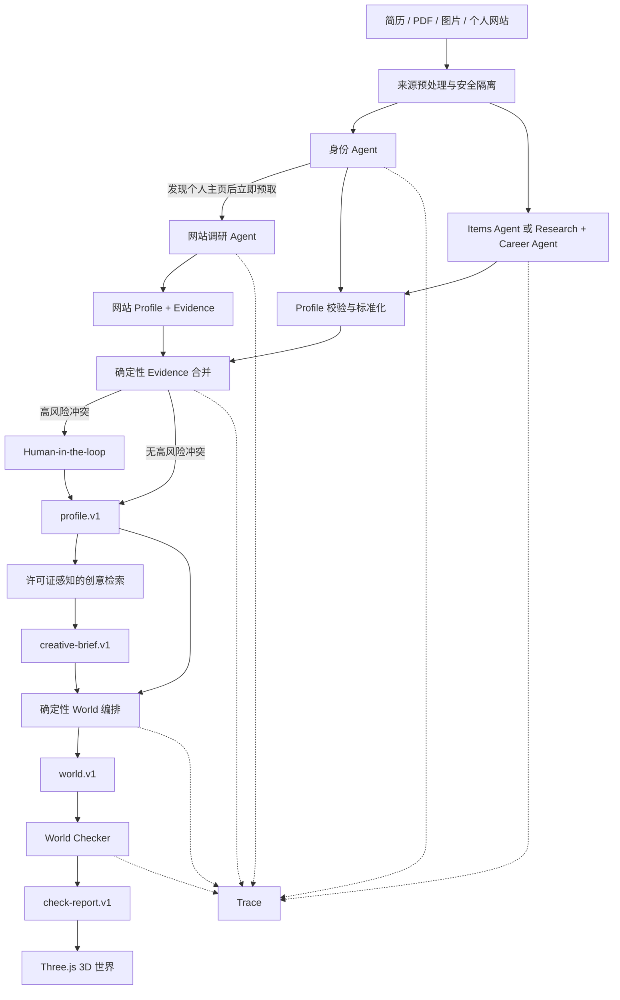

# ROOM Agent 项目面试文档

> 适用方向：Agent Engineer、AI Application Engineer、LLM Application Engineer、AI 全栈开发、后端开发。
>
> 本文基于 `zhs/agent-v1-improvement` 分支的真实实现整理。回答面试问题时，应区分“已经实现”“已经具备实验工具但尚未运行”和“后续规划”，不要把离线测试结果表述为生产指标。

## 1. 项目一句话介绍

ROOM 是一个由 Multi-Agent 驱动的简历 3D 世界生成平台：系统读取简历、PDF、图片或个人网站，通过多个 Agent 提取带证据的人物信息，再由确定性服务完成信息合并、场景编排和质量检查，最终生成可在浏览器中探索的个性化 3D 世界。

核心不是“让 LLM 直接生成 Three.js 代码”，而是建立一条可追溯、可校验、可降级的生成链路：

```text
非结构化资料
  → Agent 语义理解
  → 带 Evidence 的结构化 Profile
  → 确定性 3D World 编排
  → 自动质量检查
  → Three.js 交互式世界
```

## 2. 面试开场版本

### 2.1 30 秒版本

我做了一个叫 ROOM 的简历 3D 世界生成平台。它用身份、经历、研究、职业和网站调研等 Agent 并行理解简历与个人网站，并通过结构化中间产物和 Evidence 合并，将人物经历映射成可交互的 3D 世界。项目的重点不是单次 LLM 调用，而是完整的 Agent 工程：我实现了网站调研 Loop、6 个受控 Tool、自研 Agent 运行时、Trace、Token 与成本预算、安全隔离、人工审核和离线 Eval。目前有 40 个离线 Eval Case 和 386 个自动化测试，并且用 CI 把类型检查、快照对比、回归门禁、检索评测和 LLM Judge 校准全部变成了自动化关卡。

### 2.2 2 分钟版本

这个项目解决的问题是，传统简历和个人网站都是二维卡片，但制作一个真正可探索的 3D 个人空间需要同时具备信息提取、3D 建模、空间布局和前端交互能力。我的目标是让用户上传简历或个人网站后，系统自动理解他的经历、项目、技能和研究成果，再把这些内容变成建筑中的展品、项目岛和信息墙。

我把系统设计成 Hybrid Agent 架构。LLM Agent 只负责存在语义歧义的工作，例如识别人物身份、经历和网页内容；信息合并、许可证过滤、坐标生成、碰撞检查、页面安全和渲染由确定性代码负责。Profile 部分采用动态分片：身份 Agent 始终运行，普通简历使用 Items Agent，信息密集的简历拆成 Research Agent 和 Career Agent。身份 Agent 一旦发现个人主页，就会提前触发网站根页面预取，与其余简历分片并行执行。

网站部分实现了 `Planning → Tool Calling → Observation → Replanning` 的多轮 Loop。Planner 每轮只能从通过 URL Policy 的候选页面中选择一个页面，或者提交现有证据，不能发明 URL、工具名或修改预算。系统提供 6 个固定 Tool，并限制最多 5 页、2 层深度、80 次 Tool 调用和固定字节、时间预算。模型输出非法或 Provider 失败时，会切换到确定性排序继续执行。

工程上，我实现了 Provider 路由、结构化输出、重试、熔断、Token/成本预算、Prompt Injection 隔离、Human-in-the-loop、版本化 Artifact 和 Trace 看板。当前评测包括 30 个 Profile Case、10 个 Creative Retrieval Case 和 386 个自动化测试。需要说明的是，Profile Case 主要是合成数据，真实 Provider 实验工具已经完成，但还没有真实模型报告，因此我不会把离线解析器指标包装成模型准确率。

在可靠性方向上，我还把 Workflow 从进程内实现升级为 D1 元数据加私有 R2 正文的 Durable Store：D1 只存可查询元数据，Run 状态、输入和事件日志作为对象存储正文，steps/events/artifacts 表是从事件日志重建的投影；恢复路径用 node:sqlite 加真实 migration 做了 SQL 集成测试。同时给评测体系加了回归门禁和 LLM Judge 校准协议：前者保证迭代不会让既有指标悄悄回退，后者用加权 Kappa 回答"Judge 分数什么时候才配被引用"。

## 3. 项目背景

### 3.1 用户问题

传统简历与个人网站通常存在三个问题：

1. 信息表达形式单一，项目、能力和个人特点都被压缩成文字卡片。
2. 制作高质量 3D Portfolio 需要 3D、实时渲染、交互和前端工程能力，普通用户难以独立完成。
3. 直接让 LLM 根据简历生成页面或 Three.js 代码，容易遗漏经历、编造事实、产生不可运行的布局，而且结果难以追溯。

ROOM 的产品目标是：用户提供已有资料，系统将其自动编译为一个可探索的个人 3D 世界，同时保留每项内容的来源证据。

### 3.2 为什么它适合使用 Agent

这个问题不是单纯的文本摘要，而是一个多阶段任务：

- 需要从 PDF、图片、文本和网页中理解不同结构的信息。
- 需要根据简历内容决定是否继续访问个人网站的项目页、研究页或经历页。
- 需要在简历与网站出现冲突时做证据对比。
- 需要经过抽取、验证、合并、场景生成和质量检查多个阶段。
- 需要控制外部网页访问、模型调用次数、Token、成本和失败恢复。

因此它适合使用 Agent 处理动态语义决策，但不适合把所有步骤都交给 Agent。

### 3.3 为什么不是普通的一次 LLM 调用

一次 Prompt 同时完成“身份识别、经历抽取、网站访问、冲突判断和 3D 布局”会带来：

- 长上下文中条目遗漏；
- 输出 Schema 不稳定；
- 失败后只能整体重试，成本高；
- 无法提前触发网站调研；
- 无法定位是哪一个阶段出错；
- 难以分别评测语义抽取和空间生成；
- LLM 可能生成不安全 URL 或不可用坐标。

ROOM 将语义任务拆给不同 Agent，将稳定规则留给确定性服务，使每一层都可以单独验证和降级。

## 4. 总体架构



### 4.1 架构定位

这是一个 `Centralized Orchestration + Parallel Execution + Structured Artifact Communication + Evidence Merge` 的 Multi-Agent 系统。

- `Centralized Orchestration`：由统一控制流程决定 Agent 何时启动、并行、停止和降级。
- `Parallel Execution`：身份分片和内容分片同时运行；发现网站后，网站调研可以与剩余简历抽取并行。
- `Structured Artifact Communication`：Agent 不通过自然语言互相聊天，而是通过固定 Schema 的 Profile Draft、Profile 和 Evidence 协作。
- `Evidence Merge`：来自简历和网站的结果不是简单覆盖，而是根据证据、来源优先级和人工决定合并。

它不是 CrewAI 式的角色对话，也不是多个 Agent 自由协商的去中心化系统。面试中应该称为“受控的、集中编排的 Multi-Agent 系统”。

## 5. 每一步是如何实现的，以及为什么这样做

### 5.1 Step 1：来源预处理

支持的输入包括文本、Markdown、PDF、图片和公开个人网站。

实现方式：

- 文本输入先做长度限制和不可信指令隔离。
- PDF 同时执行快速文本/链接预解析和模型文档理解，保留页码与行级 Evidence。
- 图片作为受控多模态内容块提交给 Profile Agent。
- 网页请求在访问前校验协议、凭据、端口、Host 和 DNS A/AAAA 结果，每次重定向都重新校验。
- 原始资料中的指令型文本会被隔离，但保留换行数量，避免 Evidence 行号发生偏移。

为什么这样做：

- Agent 输入来自用户和公网，必须默认视为不可信。
- 如果先让模型读取再做安全处理，Prompt Injection 已经进入上下文。
- 保留行号可以让后续 Claim 精确回溯到原始资料。

### 5.2 Step 2：动态 Profile Agent 分片

代码中定义了 4 种简历抽取分片，再加上独立的网站调研角色：

| Agent/分片 | 主要职责 | 启动条件 |
| --- | --- | --- |
| 身份 Agent | 姓名、简介、所在地、联系方式、个人主页 | 每次运行 |
| Items Agent | 通用经历、项目、教育、技能和成果抽取 | 普通或较短简历 |
| Research Agent | 论文、研究、发表和学术成果 | 信息密集且包含研究内容 |
| Career Agent | 教育、实习、工作、活动和荣誉 | 信息密集且包含教育或工作内容 |
| 网站调研 Agent | 多页面调研与网站 Profile 补全 | 发现或直接输入个人网站 |

这里有一个必须在面试中讲清楚的细节：这 5 类 Agent 并不是每次全部启动。身份 Agent 始终运行；内容部分根据简历结构选择一个 Items Agent，或者拆成 Research Agent 与 Career Agent。这样可以避免为了“看起来像 Multi-Agent”而固定增加模型调用。

具体流程：

1. 用确定性规则估计简历中的研究、教育和工作条目数量。
2. 身份分片与内容分片同时发起模型调用。
3. 如果简历信息密集，并同时存在研究和职业内容，则将 Items 拆成 Research 与 Career 两个并行分片。
4. 各分片使用独立 Prompt 和 JSON Schema。
5. 返回结果先进行结构校验，再按 `kind + title` 去重。
6. 校验失败时，最多进行一次带错误反馈的修复尝试，即外层最多 2 次抽取尝试。

为什么这样做：

- 身份信息较短，能够更快返回并触发网站预取。
- 长简历拆分后，每个 Agent 的任务边界更清晰，减少研究成果或职业经历被遗漏。
- 普通简历不强制拆分，避免无意义地增加 Token、延迟和成本。
- 分片失败可以单独记录和分析，不需要把整条 Pipeline 当作黑盒。

### 5.3 Step 3：提前触发网站并行调研

身份 Agent 返回后，系统立即检查 `personalWebsite`。如果存在合法 URL，就触发网站根页面预取，不必等待 Research、Career 或 Items 分片结束。

```text
身份 Agent ──→ 发现个人主页 ──→ 预取网站根页面 ─────┐
Items / Research / Career Agent ──→ 完成简历 Profile ─┤
                                                     └→ 根据缺失字段继续调研
```

为什么这样做：

- 网站 I/O 与模型抽取都可能较慢，串行执行会放大端到端延迟。
- 根页面预取不依赖完整 Profile，可以安全提前执行。
- 只有在完整简历 Profile 生成后，系统才根据缺失字段决定是否访问项目、研究、经历等子页面，避免盲目爬取。

### 5.4 Step 4：网站调研 Loop

网站调研 Agent 使用：

```text
Planning → Tool Calling → Observation → Replanning
```

每一轮的实现如下：

1. 系统根据当前 Profile 计算仍然缺少的字段。
2. `list_links` 从当前页面产生同域候选链接。
3. 确定性 URL Policy 先删除外域、私网、登录、管理、二进制等不允许的链接。
4. 系统构造有界 Observation，只包含缺失字段、已访问页面摘要、候选 URL 和剩余预算。
5. Planner 只能返回 `continue(候选 URL)` 或 `submit`。
6. 控制面执行页面 Tool，并根据新结果产生下一轮 Observation。
7. 达到充分证据或预算上限后，将已检查页面提交给 Website Profile Agent。
8. Profile 中的每条 Claim 再反向验证到具体页面、行号和摘录。

系统共有 6 个固定 Tool：

| Tool | 作用 |
| --- | --- |
| `fetch_page` | 获取一个已经授权的网页 |
| `list_links` | 解析并排序同域候选链接 |
| `inspect_page` | 将网页转换为带行号的标准化证据文本 |
| `extract_media` | 提取受限的非装饰性媒体元数据 |
| `submit_profile` | 将已检查页面组合后提交给 Profile Agent |
| `validate_claim` | 验证 Claim 的 URL、定位符和摘录是否真实存在 |

默认边界：

- 最多 5 个页面；
- 链接深度最多 2 层；
- 最多 80 次原子 Tool 调用；
- 单页最多 1 MB，总下载文本最多 3 MB；
- 提交模型的网页文本最多 140,000 字符；
- 导航时间最多 24 秒；
- 重定向最多 4 次。

为什么不允许模型自由输入 URL 或工具名：

- 网页正文可能包含 Prompt Injection。
- 自由 URL 会扩大 SSRF 与越权爬取风险。
- 自由工具名会让控制面失去可验证性。
- 候选集合约束仍保留了模型的语义判断能力，同时把安全策略掌握在确定性代码中。

### 5.5 Step 5：Observation 与 Replanning

Observation 不是完整网页正文，而是一个有界对象：

```ts
{
  iteration,
  rootUrl,
  missingFields,
  visitedPages: [{ url, title, depth }],
  candidates: [{ url, score, reasons }],
  budgetRemaining: { pages, steps, bytes }
}
```

Planner 根据这个对象决定下一步。每访问一个页面后，`missingFields`、候选集合和预算都会变化，所以它不是预先生成固定计划，而是根据执行结果动态 Replanning。

为什么不把完整网页交给 Planner：

- Planner 只负责导航决策，不负责语义抽取。
- 减少 Token 使用和 Prompt Injection 暴露面。
- 让 Planner 的输入和决策更容易记录、重放和测试。

### 5.6 Step 6：确定性降级

如果 Planner 出现以下情况：

- Provider 请求失败或超时；
- 返回非法 JSON；
- 选择了候选集合外的 URL；
- 输出不符合 Schema；

系统不会让整次生成失败，而是按照“缺失字段覆盖度 + 链接相关性”的确定性排序选择下一个页面，并在 Trace 中记录 `deterministic-fallback`。

为什么需要降级：

- Agent 系统的核心不是保证模型永不失败，而是模型失败后系统仍然有边界地继续或停止。
- 降级路径可离线测试，能够避免 Provider 波动直接破坏用户体验。
- Trace 会明确标注本轮来自模型还是确定性降级，便于后续 Eval。

### 5.7 Step 7：结构化 Artifact 与 Evidence

所有模型结果都必须经过 JSON Schema、结构校验和标准化，原始模型输出不能直接进入 3D Renderer。

核心 Artifact：

| Artifact | Schema Version | 用途 |
| --- | --- | --- |
| Profile | `profile.v1` | 统一的人物资料 |
| Profile Merge Report | `profile-merge-report.v1` | 冲突与自动合并决策 |
| Creative Brief | `creative-brief.v1` | 视觉参考与空间方向 |
| World Plan | `world.v1` | 房间、展品、交互和坐标 |
| Check Report | `check-report.v1` | 内容、空间、交互和性能检查 |

Artifact 使用统一 Envelope：

```ts
{
  artifactType: "profile",
  schemaVersion: "profile.v1",
  data: { ... }
}
```

未知版本会明确报错，而不是静默读取。

Evidence 记录来源、定位符和摘录，使系统能回答“这个结论来自简历哪一行或网站哪一页”。它的作用包括：

- 检查模型是否生成无来源声明；
- 在简历和网站冲突时向用户展示双方证据；
- 为 3D 展品详情提供来源追溯；
- 支持 Eval 对 Evidence 覆盖率和准确率进行判断。

### 5.8 Step 8：Evidence 合并与 Human-in-the-loop

简历和个人网站可能都提供了合法证据，但内容并不一致，例如职位、日期、项目角色和 URL。系统没有使用简单的对象覆盖，而是执行 Claim-aware Merge。

自动合并依据包括：

- 是否存在直接 Evidence；
- 来源优先级；
- 是否为用户确认值；
- 同一条目是否能够稳定匹配；
- 字段是否属于高风险字段。

需要人工审核的典型情况：

- 姓名、Headline、所在地或个人网站冲突；
- 同一经历的时间、角色或项目 URL 冲突；
- 关键字段或技术栈没有直接证据；
- 电话类联系方式准备公开；
- Profile Photo 或项目封面映射置信度低于阈值。

用户接受或编辑的值会标记为 `user-confirmed`，具有最高优先级，后续 Agent 结果不能自动覆盖。

为什么需要 Human-in-the-loop：

- 冲突不等于某个 Agent 出错，可能是简历和网站更新时间不同。
- 对职业身份和隐私字段，系统不应该用模型置信度替代用户决定。
- 人工审核只拦截高风险字段，而不是要求用户逐项检查所有输出。

### 5.9 Step 9：Creative Retrieval

Profile 确认后，系统从 13 条经过整理的参考模式中选择适合的空间设计方向：

```text
Profile
  → 中英文词汇扩展
  → Metadata Filter
  → License Guard
  → 加权词汇排序
  → 稳定 Tie-breaker
  → Creative Brief
```

这个模块是确定性检索服务，不是 Agent，也不是向量 RAG。

为什么这样做：

- 当前目录只有 13 条素材，词汇检索已经达到 Recall@3 100%。
- 引入 Embedding 和向量数据库会增加调用成本、部署组件和评测复杂度。
- License 必须是硬规则，不能只是一个排序加分项。
- 只有当素材达到 200 条以上，并且人工复核 Eval 显示词汇 Recall 低于阈值时，才考虑向量检索。

### 5.10 Step 10：确定性 World 编排

World Orchestrator 将 Profile 和 Creative Brief 编译为 `world.v1`：

- 每个简历条目映射为唯一展品；
- 项目映射为项目岛；
- 教育和工作经历进入时间线或信息墙；
- 技能映射为技能展示对象；
- 联系方式、成就和人物简介映射为可交互表面；
- 生成房间、Portal、展品位置、Hitbox 和相机聚焦目标。

为什么不用 LLM 直接生成坐标或 Three.js 代码：

- 坐标和碰撞是精确工程问题，模型生成结果不可稳定复现。
- 直接生成代码会扩大安全风险，且难以保证可构建。
- 确定性编排能够保证同一个 Profile 得到稳定 World，并便于 Snapshot 和回归测试。
- 语义理解与空间工程解耦后，可以独立替换 3D 模型或布局算法。

### 5.11 Step 11：World Checker

生成 World 后会运行确定性检查：

- `Content parity`：每条简历内容是否恰好进入场景；
- `Spatial collisions`：展品 AABB 是否重叠；
- `Click targets`：点击动作、Hitbox 和相机目标是否有效；
- `Room graph`：所有房间能否从入口抵达；
- `Mobile budget`：Draw Call、Triangle、实时灯光和展品数量是否超限。

为什么需要 Checker：

Agent 输出“语义正确”不代表 3D 世界“可使用”。内容遗漏、空间重叠和无法点击属于不同质量维度，必须在发布前用确定性规则检查。

### 5.12 Step 12：Three.js 运行时

最终结果由 React Three Fiber 与 Three.js 渲染到 Mardou 博物馆 GLB 中，支持：

- 长走廊入场；
- 第一人称 WASD 与鼠标视角；
- 边界和多射线碰撞；
- 展品聚焦与详情阅读；
- 楼梯和二层空间；
- 来源证据查看；
- 3D Companion 的 Profile-grounded QA。

这部分体现项目不是单纯的 Agent Demo，而是 Agent 结果真实驱动一个复杂下游产品。

## 6. 自研 Agent 运行时是怎么做的

这里的“自研 Agent 运行时”不是重新实现一个大型 LangGraph，而是围绕本项目需求实现了一组小型、类型安全的基础能力。

### 6.1 Provider Routing

系统支持主 Profile Provider 和可选的独立 Website Provider。路由时会根据任务类型确定优先级：

- Resume Profile 优先使用主 Provider；
- Website Profile 优先使用 Website Provider；
- 主要 Provider 不可用时，可以回退到另一 Provider；
- Provider 内部可以在 `tool` 和 `json-schema` 两种结构化输出方式间回退；
- 可按配置尝试候选 Model 和备用 Key。

每次调用都记录 Provider、Model、Mode、Prompt Version、Attempt、Fallback Count 和延迟。

### 6.2 Structured Output 与 Validation

模型必须通过 Tool 参数或 JSON Schema 返回结果。返回后还会执行：

1. JSON 解析；
2. 分片级结构完整性检查；
3. 最低条目数量检查；
4. Evidence 行号与摘录标准化；
5. Profile 归一化；
6. 必要时把错误反馈给下一次修复尝试。

Structured Output 解决“格式像 JSON 但字段不完整”的问题，业务 Validation 解决“Schema 合法但内容仍不可用”的问题，两者不能互相替代。

### 6.3 Retry 与 Circuit Breaker

- Profile 外层最多 2 次抽取尝试。
- Provider 瞬时失败使用有界指数退避，从 50 ms 开始，最多 400 ms。
- 同一 Provider 连续 3 次瞬时失败后打开 Circuit Breaker。
- Circuit Breaker 默认冷却 30 秒。
- 所有尝试共享同一 Run Budget，重试不会绕过预算。

为什么重试和熔断都需要：

- Retry 用于处理偶发超时、限流或短暂 5xx。
- Circuit Breaker 防止 Provider 持续故障时不断发送无效请求。
- 如果只有 Retry，没有共享预算，多个并行分片可能造成失控调用。

### 6.4 Token、成本和时间预算

Profile Run 的默认保守上限：

- 最多 16 次模型调用；
- 最多 600,000 个估算 Input Token；
- 最多预留 160,000 个 Output Token；
- 估算成本上限 20 美元；
- 总时长上限 240 秒。

Website Planner 有独立的小预算：最多 6 次模型调用、30,000 Input Token、3,000 Output Token 和 1 美元估算成本。

需要在面试中区分：

- 调用前预算使用字符数或内容类型进行保守估算；
- Trace 中的实际 Token 只有 Provider 返回 usage 时才视为测量值；
- Provider 没有返回 usage 时显示“未返回”，不能把估算值冒充真实 Token。

### 6.5 Cancellation 与并发限制

- 用户请求取消、客户端断开和 Provider Timeout 通过组合后的 `AbortSignal` 向下传递。
- 并行 Profile 分片共享同一个 Budget 和 Circuit Breaker。
- API 使用按客户端计算的进程内并发租约，达到上限时返回 429。
- Workflow 支持 Run Cancel、Resume、Idempotency Key 和失败节点恢复。

### 6.6 Trace

Trace 记录以下事件：

- Run 开始、完成和失败；
- Step 开始、完成和重试；
- Model 调用和失败；
- Tool 调用和失败；
- Planner 决策；
- Validation、Security 和 Budget 事件；
- Artifact 创建。

看板汇总：

- Model Call 数；
- Tool Call 数；
- Retry 次数；
- Input/Output Token；
- 估算成本；
- Model 与 Tool 延迟；
- Artifact 数量。

Trace 写入 Store 前会统一脱敏。API Key、Authorization、Cookie、完整 Prompt、简历正文、网页正文和 Evidence 摘录都不作为 Trace 字段。

当前 Trace Store 是内存实现，只适合本地调试和单进程运行，不保证进程重启后的恢复。

### 6.7 跨 Run 聚合指标

单 Run Trace 回答"这次运行发生了什么"，我还补了跨 Run 的聚合层来回答"Agent 整体表现如何"：

- `GET /api/agent-runs/metrics` 输出任务完成率（只统计已完结 Run）、模型/工具延迟 p50/p95、实测 Token、预估成本、Planner 降级率和按 Provider/Model 的分解；
- Token 只累计 Provider 返回 usage 的调用，`measuredUsageCalls` 明确标注覆盖率；
- 并发租约的活跃数与拒绝数也进入同一端点，但不暴露任何客户端标识；
- 单 Run 事件可通过 `?format=jsonl` 导出 NDJSON，用于离线分析；
- 创建页有一个默认折叠的 Fleet 面板，每 5 秒轮询该端点，空窗口时自动隐藏。

需要讲清楚的边界：这是进程内最多 100 个 Run 的窗口聚合，不是全量历史指标；它证明的是"知道该怎么度量"，上线后应换成持久化指标后端。

## 7. Workflow、Checkpoint 与恢复

项目实现了框架无关的 `RoomWorkflowEngine`，节点为：

```text
prepare_source
  → extract_profile
  → direct_world
  → compile_world
  → check_world
  → complete
```

它支持：

- 显式 Run State；
- 节点 Attempt；
- 顺序事件；
- Artifact Version Checkpoint；
- Idempotency Key；
- Cancel；
- 从第一个未完成节点 Resume；
- Human Review Interrupt。

高风险冲突会让状态进入 `waiting_for_review`。用户提交决定后，只替换 Profile Artifact，并从下一个未完成节点继续，不重复执行已经完成的节点。

当前边界：

- 默认 Store 仍为最多 100 个 Run 的进程内实现；
- 已实现 `DurableWorkflowStore`（D1 元数据 + 私有 R2 正文），与内存 Store 遵循同一 `WorkflowStore` 契约和冲突语义；运行时装好 `DB` 与 `WORKFLOW_OBJECTS` 绑定后由 `resolveWorkflowStore()` 自动启用；
- 恢复能力通过"新 Store 实例 + 同一后端"的重启模拟测试验证，且每个 Store 的 `persistence` 描述符会进入公开 Run 快照，`survivesProcessRestart` 只在 D1/R2 真正生效时才为 `true`；
- D1/R2 仍未在本仓库绑定，真实 Worker 重启恢复属于部署验证，不能宣称线上已持久恢复；
- Live Profile Agent 仍主要走请求级 `/api/parse`，尚未完全迁入持久 Workflow。

保留与清理策略也已落地：终态 Run 的源正文只保留 24 小时（同时是失败重试窗口，超时后无法 resume，引擎会明确拒绝），完整记录保留 30 天，活动 Run 永不清理。D1 Store 的 SQL 正确性用 node:sqlite 加仓库里的真实 migration 做了集成测试，覆盖冲突语义、投影重建、级联删除和"D1 表内无简历正文"的隐私断言；Node 22 上这些测试自动跳过，CI 用 Node 22/24 双版本矩阵运行。

## 8. 为什么没有使用 Agent 框架

### 8.1 核心回答

我不是因为不了解 LangGraph 才没有使用，而是基于当前复杂度和部署边界做了延迟引入的决策。当前核心流程是一个节点数量有限、状态明确的集中式 Pipeline，真正复杂的部分在 Evidence、Tool Policy、预算、安全和 3D 编译，而不是图编排本身。用 TypeScript 的类型、Promise 并发和小型 Workflow Engine 已经能清晰表达当前流程，引入框架不会直接提高抽取质量，反而会同时增加运行时、迁移和 Edge 兼容成本。

### 8.2 具体原因

1. **当前图不复杂**：核心路径仍接近线性，只包含动态分片、一次网站 Loop 和一个人工审核中断。
2. **业务边界已经独立**：Profile、Merge、World、Checker 都通过版本化 Artifact 解耦，不依赖框架才能复用。
3. **部署在 Edge 环境**：候选框架必须验证 Cloudflare Worker 兼容性、包体积和持久化适配。
4. **持久化尚未启用**：当前没有 D1/R2 绑定，先换框架也不会自动获得真正的跨进程恢复。
5. **避免混合变量**：Eval 还在建立阶段，如果同时更换 Prompt、模型和编排框架，很难判断质量变化来自哪里。
6. **安全策略不依赖框架**：URL Policy、SSRF 防护、Token Budget、License Guard 和 Schema Validation 都必须由业务代码自己实现。
7. **减少抽象成本**：当前本地 Engine 代码规模有限，行为可直接测试和调试。

### 8.3 这是否属于“重复造轮子”

回答时不要说“我写了一个比 LangGraph 更好的框架”。更准确的说法是：

> 我只实现了项目当前需要的最小运行时能力，包括 Provider Routing、Budget、Circuit Breaker、Trace 和线性 Workflow Checkpoint。业务节点保持框架无关，未来如果复杂度越过门槛，可以把这些节点接入 LangGraph，而不是推倒重写。

### 8.4 什么时候会引入框架

当出现以下至少一种生产需求时重新评估：

- 跨请求、跨进程的节点级 Checkpoint 与恢复；
- 多个 Human Interrupt 交错出现；
- 多分支 Repair Loop；
- Workflow Replay、Time Travel 或复杂状态回放；
- 动态子图明显增加，手写状态转移开始难以维护；
- 框架在 Cloudflare Edge、D1/R2 Adapter 和当前 Artifact Contract 上验证通过。

### 8.5 如果后续引入 LangGraph，如何迁移

1. 保留 Profile、Merge、Creative Retrieval、World 和 Checker 的纯业务函数。
2. 将 `RoomWorkflowState` 映射为 Graph State。
3. 将现有节点 Handler 包装为 LangGraph Node。
4. 使用 Artifact Envelope 作为节点输入输出边界。
5. 将 Human Review 映射为 Interrupt。
6. 先接入 D1/R2 持久化 Adapter，再验证真实 Worker 重启恢复。
7. 用同一 Eval 数据集对比迁移前后质量、延迟、成本和可维护性。

## 9. 为什么采用 Hybrid Agent，而不是所有模块都做成 Agent

| 模块 | 是否使用 LLM Agent | 原因 |
| --- | --- | --- |
| 身份与经历理解 | 是 | 输入结构变化大，需要语义理解 |
| 网站导航决策 | 是，但强约束 | 下一页选择需要语义判断 |
| URL 安全与 Tool Dispatch | 否 | 属于安全规则，必须可证明、可测试 |
| Profile 合并 | 否 | 冲突与优先级需要稳定、一致 |
| Creative Retrieval | 否 | 目录小、规则明确、许可证是硬约束 |
| World 坐标与布局 | 否 | 几何和性能需要稳定结果 |
| World Checker | 否 | 验收规则必须可重复 |
| Three.js Renderer | 否 | 属于确定性运行时 |

这套边界的原则是：

> 把“需要理解”的问题交给 Agent，把“必须正确”的问题交给确定性程序。

## 10. 安全设计

### 10.1 Prompt Injection

- 简历、网页和 Tool Output 全部视为不可信。
- 指令型内容在进入 LLM 前被隔离。
- Planner 看不到完整网页正文，只看到有界元数据。
- 网页文本不能指定 Tool 名称、URL 或预算。
- 测试覆盖中英文 Injection 和 Tool Output Injection。

### 10.2 SSRF 与网页访问

- 只允许 HTTP/HTTPS；
- 拒绝带凭据 URL 和非标准端口；
- 拒绝 localhost、私网、链路本地、保留地址和特殊 IPv6；
- 每次 Redirect 都重新校验；
- 进行 DNS A/AAAA 安全检查；
- 网站调研默认限制在同一 Host 及其 `www` 形式。

已知残余风险：DNS 预检和实际 Edge Fetch 之间不能绑定同一个 IP，理论上仍存在 DNS Rebinding 的时间差。高安全部署需要受控 Egress Proxy。面试中主动说出这个边界，比声称“完全解决 SSRF”更可信。

### 10.3 隐私与 Trace

- 浏览器 Provider Key 只保存在当前标签页 `sessionStorage`；
- Key 只发送到解析 API，不写入仓库或 `localStorage`；
- Trace 不记录完整 Prompt、简历、网页正文、Header 或 Cookie；
- Companion 只能读取 Profile 公共字段白名单；
- 私人日记、密码、访客信息不会进入公开 Agent Context。

### 10.4 失控调用

- Model Call、Input/Output Token、成本和总时长有共享上限；
- Tool 的页面、深度、Step、字节和时间有上限；
- 重试共享同一预算；
- Circuit Breaker 阻止故障 Provider 持续调用；
- 客户端取消能够中止下游请求。

## 11. Eval 是怎么做的

### 11.1 Profile Eval

当前有 30 个离线 Profile Case：

- `smoke`：5 个；
- `full`：30 个；
- 主要为虚构、合成或预标注数据；
- 只有 2 个经过人工复核；
- 当前提交的基线主要评估确定性 Parser，不代表真实 LLM Profile Agent 准确率。

Eval 检查：

- 身份字段；
- 条目 Precision、Recall 和 F1；
- 结构化字段；
- Evidence 覆盖率和准确率；
- 无 Evidence 声明；
- Forbidden Claim；
- 成本与失败分类。

### 11.2 Creative Retrieval Eval

共有 10 个离线 Case，覆盖中英文匹配、Metadata、License Guard 和不同检索用途。

当前结果：

- `Recall@3 = 100%`；
- `Precision@3 = 60%`；
- `nDCG = 100%`；
- License 违规率 `0%`；
- Creative Brief 引用完整率 `100%`。

这些指标只说明当前 13 条目录上的检索排序和许可证策略，不代表 3D 设计质量或用户偏好。

### 11.3 Automated Test

当前执行：

```bash
node --test tests/*.test.ts tests/security/*.test.ts
```

结果为 385 项通过、0 项失败（另有 1 项 SSR 测试随完整 `npm test` 运行）。覆盖：

- Profile 分片和并发；
- Website Research Loop 与 6 个 Tool；
- Provider Fallback、Budget 和 Circuit Breaker；
- Prompt Injection、SSRF、Trace 脱敏和隐私隔离；
- Artifact、Merge、Human Review 和 Workflow Resume；
- Durable Store 恢复、保留策略与 node:sqlite 真实 SQL 集成；
- Trace 聚合、并发指标与 LLM Judge 校准；
- Creative Retrieval 与 License Guard；
- World 编排、碰撞、交互和 3D Runtime。

完整 `npm test` 还包括 Mardou 布局审计、资源审计、生产 Build 和 SSR Test。

### 11.4 CI 与回归门禁

仓库配有 GitHub Actions CI（Node 22/24 双版本矩阵），每次推送执行：类型检查、Lint、Agent Pipeline 快照对比（核心 Artifact 的 SHA-256 门禁）、全部单测与安全测试、Profile Eval 回归门禁、Creative Retrieval 阈值门禁、LLM Judge 校准门禁，以及完整构建与 SSR 测试。

回归门禁解决一个实际问题：smoke/full 数据集阈值是 100%，确定性 Parser 有已知缺陷，基线按设计"未通过"，所以阈值 gate 永远为红。`npm run eval:regression` 改为与已审核基线做相对对比——任何指标回退、失败分类计数上升或用例数减少都会失败；指标改善必须人工审核后显式更新基线，`--write` 在存在回退时拒绝生效。

LLM Judge 校准协议（Q35 的后续方向）也已落地：人工评分与 Judge 评分在同一样本上配对，按维度计算 exact/within-one agreement、MAE 和二次加权 Cohen's Kappa，全部维度通过门槛（Kappa ≥ 0.6、within-one ≥ 0.9）才允许引用 Judge 分数。当前 20 个样本是合成预标注数据，只证明管线可运行，不能宣称 Judge 已校准。

### 11.5 Real Provider Eval

项目已经提供真实 Provider 实验脚本：

```bash
npm run eval:experiment:preflight
npm run eval:experiment -- --dataset smoke --allow-model-calls
```

脚本能够记录 Provider、Model、Mode、Commit、Node 版本、Token、延迟、成本和回归结果，并且必须显式使用 `--allow-model-calls` 才会触发付费调用。报告还会输出单用例维度的 p50/p95 延迟、Token 与成本分布（只统计 Provider 返回 usage 的用例）——聚合总数会掩盖尾部行为，而收紧生产预算需要的正是典型值与尾部值。

当前没有配置 Provider Key，因此没有真实 Provider 实验报告。面试时应说“真实评测 Runner 已完成，真实模型结果尚未运行”，不能说“模型准确率达到 95%”。

## 12. 项目的技术亮点与含金量

### 12.1 不只是 Prompt Engineering

项目覆盖 Agent 岗位常见的完整工程链路：

- 任务拆分与集中编排；
- 并行模型调用；
- Structured Output；
- Tool Calling Loop；
- 动态 Replanning；
- Provider Routing；
- Retry、Budget 和 Circuit Breaker；
- Evidence、Artifact 和 Human-in-the-loop；
- Trace、Eval 和安全测试；
- 真实 3D 下游应用。

### 12.2 Agent 的输出真正驱动产品

很多校招 Agent 项目最终只输出一段文字。ROOM 的 Agent 输出会继续进入 Profile 合并、World 编译、质量检查和 Three.js Renderer，任何字段遗漏都会影响具体展品。这证明你考虑了 LLM 与传统软件系统的边界，而不只是调用 API。

### 12.3 具备架构取舍

项目没有为了关键词盲目加入 LangGraph、向量数据库或让所有模块变成 Agent，而是为框架和向量检索都定义了引入门槛。面试时可以用这一点展示“根据问题选择技术”，而不是“根据热门技术包装问题”。

### 12.4 有诚实的评测边界

能区分：

- 合成数据与真实数据；
- 确定性 Parser 指标与 LLM Agent 指标；
- Token 估算与 Provider 实测；
- Retrieval 质量与设计质量；
- 内存恢复与持久恢复。

这种边界意识是 Agent 工程岗位的重要能力。

### 12.5 工程化与可靠性是闭环的

除了 Agent 逻辑本身，项目把可靠性做成了完整工程闭环：

- GitHub Actions CI 双版本矩阵，把类型检查、快照对比、回归门禁、检索评测、Judge 校准、构建与 SSR 测试全部自动化；
- Workflow 持久化采用"D1 元数据 + R2 正文 + 事件溯源投影"布局，并用 node:sqlite 对真实 migration 做 SQL 集成测试；
- 数据保留策略（24 小时源正文、30 天记录、活动 Run 豁免）有明确实现与删除测试；
- 跨 Run 的 p50/p95、成本、完成率聚合端点与前端 Fleet 面板，让"如何度量 Agent"有具体答案。

这些不是 DevOps 装饰：每一条都对应 Agent 系统的真实失效模式——悄悄回退、进程丢失、数据滞留、尾部延迟。

## 13. 面试官高频问题与参考回答

### 13.1 项目与产品

#### Q1：为什么要做这个项目？

传统简历的信息密度高但体验平面化，而高质量 3D 个人网站制作门槛很高。我希望用户只提供已有简历或个人网站，系统就能自动构建一个有空间叙事的个人世界。技术挑战在于，不能让 LLM 随意生成代码和事实，所以我重点解决了证据抽取、受控 Tool Loop、冲突审核和确定性 3D 编译。

#### Q2：用户最终获得什么？

用户获得一个可以在浏览器中第一人称探索的 3D 世界。简历中的项目、研究、工作经历和技能会映射为项目岛、展品、时间线或信息墙，每项内容可以点击查看，并能回溯到原始资料 Evidence。

#### Q3：这个项目最难的部分是什么？

最难的不是模型调用，而是如何把概率性的 Agent 输出接入一个要求稳定的 3D 产品。我通过 JSON Schema、版本化 Artifact、Evidence Merge、人工审核和确定性 World Checker 建立边界，使模型负责理解，传统代码负责安全和交付。

#### Q4：与普通 AI 简历解析项目有什么区别？

普通项目往往止于结构化 JSON。ROOM 还包含多页面网站调研、多个来源的证据冲突处理、Agent Runtime、Trace、Eval，以及从 Profile 到 3D World 的可验证编译过程。

### 13.2 Multi-Agent 架构

#### Q5：为什么叫 Multi-Agent，而不是多次调用 LLM？

不同分片拥有独立职责、Prompt、Schema、运行时记录和输出边界，并由 Orchestrator 管理并发、触发和合并。它们不是无状态地重复同一个 Prompt，而是分别承担身份、通用内容、研究、职业和网站调研任务，通过 Artifact 与 Evidence 协作。因此可以称为集中式 Multi-Agent，但我不会称其为自由协商式 Agent Team。

#### Q6：5 个 Agent 是否每次都运行？

不是。身份 Agent 每次运行；普通简历使用 Items Agent；信息密集且同时包含研究与职业内容时，Items 才拆成 Research 和 Career 两个分片。网站 Agent 只有发现或直接输入个人网站时才运行。动态拆分是为了在完整性与 Token 成本之间平衡。

#### Q7：这些 Agent 如何通信？

它们不进行自然语言对话，而是通过结构化 Artifact 和 Evidence 间接通信。身份 Agent 会通过个人主页 URL 触发网站预取；各简历分片输出 Profile Draft；最终由确定性 Merge Service 汇总。这样通信可验证、可重放，也更容易定位错误。

#### Q8：为什么不让 Agent 互相讨论后决定最终答案？

人物经历属于事实数据，自由讨论会增加 Token 和不确定性，但不能保证事实更正确。我更关心每个 Claim 是否有 Evidence，以及冲突是否被明确展示。低风险字段由确定性策略合并，高风险字段交给用户决定。

#### Q9：为什么把身份单独拆出来？

身份字段数据量小、返回快，而且其中的个人主页 URL 可以尽早触发网站 I/O。这样能让网站根页面预取与剩余简历分片并行，降低整体等待时间。

#### Q10：为什么 Research 和 Career 要动态拆分？

长简历中研究成果与职业经历结构差异大，放在一个 Prompt 中容易出现条目遗漏。动态拆分使两个 Agent 分别关注自己的内容族；短简历继续使用 Items，避免固定增加调用。

#### Q11：Multi-Agent 带来了什么新问题？

主要是结果重复、字段冲突、成本增加和 Trace 复杂度。我通过 `kind + title` 去重、Evidence-aware Merge、共享 Run Budget、统一 Trace 和动态分片控制这些问题。

### 13.3 Tool Calling 与网站调研 Loop

#### Q12：Website Research Loop 是什么？

它是网站调研 Agent 的多轮执行过程：先根据缺失信息做 Planning，再调用网页 Tool，读取 Observation，然后根据新结果 Replanning。直到证据充分、Planner 主动提交或达到预算上限。

#### Q13：它和 ReAct 有什么关系？

思想上都包含推理、行动和观察，但 ROOM 没有暴露自由文本 Chain-of-thought，也不允许模型自由选择任意 Tool。模型只提交结构化决策，从候选 URL 中选择下一页或结束，因此更准确的说法是 policy-bounded Plan/Tool/Observation Loop。

#### Q14：Planner 能调用哪些 Tool？

底层有 `fetch_page`、`list_links`、`inspect_page`、`extract_media`、`submit_profile` 和 `validate_claim` 6 个原子 Tool。但 Planner 本身不能自由指定 Tool 名，它只决定继续访问哪个候选 URL或提交；具体 Tool 顺序由确定性控制面执行。

#### Q15：这还能算 Tool Calling 吗？

可以，但应该强调是受控 Tool Calling。模型通过 Tool 或 JSON Schema 提交导航 Action，控制面再调度固定 Tool。它牺牲一部分自由度，换来安全性、可测性和确定停止。

#### Q16：Observation 为什么不包含网页正文？

Planner 的职责是决定导航，不是抽取内容。只提供缺失字段、页面摘要、候选 URL 和预算，既减少 Token，也减少 Prompt Injection 暴露。网页正文最后由 Website Profile Agent 处理。

#### Q17：如何保证 Agent 不会无限循环？

页面数、深度、Tool Call、字节、模型输入和时间都有硬上限；Planner 只能访问未访问的候选 URL；没有候选或达到预算时会提交部分结果并停止。

#### Q18：Planner 选择了恶意 URL 怎么办？

Planner 只能返回 Observation 中的精确候选 URL，解析后还会再次检查是否属于候选集合。候选 URL 在进入 Observation 前已经通过协议、Host、路径类型、DNS 和同域 Policy。非法计划会进入确定性降级。

#### Q19：Provider 失败后怎么办？

Trace 记录 Planner 失败，控制面使用缺失字段和候选相关性进行确定性排序。这样网站研究可以继续，不会因为一次模型故障完全失败。

### 13.4 Runtime、稳定性与成本

#### Q20：自研 Agent Runtime 包含什么？

主要包含 Provider Routing、Structured Output、Validation、Retry、Circuit Breaker、共享 Token/成本/时间预算、Abort、并发限制、Artifact Version、Workflow State 和 Trace。它是围绕项目需要的小型运行时，不是通用框架替代品。

#### Q21：Provider Routing 如何工作？

系统区分主 Profile Provider 和 Website Provider，根据任务类型决定优先顺序。Provider 内部可以在 Tool 和 JSON Schema Mode、候选 Model 与备用 Key 之间回退。每次回退都会记录 Fallback Count，并受同一个 Run Budget 约束。

#### Q22：为什么既有 Retry 又有 Fallback？

Retry 处理同一 Provider 的瞬时故障，Fallback 切换 Mode、Model 或 Provider。两者解决的问题不同。Circuit Breaker 则在同一 Provider 连续失败时停止继续尝试。

#### Q23：Token Budget 如何实现？

每次 Provider 请求前先预留 Input、Output 和成本预算。多个并行分片共享同一个 Budget，所以即使同时 Retry，也不能绕过总上限。Provider 返回 usage 后，Trace 记录实际 Token；没有 usage 时明确显示未知。

#### Q24：为什么成本上限设置得看起来很大？

当前是保守的系统硬上限，不代表正常单次运行会消费这些额度。上限需要覆盖 PDF、多模态输入和 Provider Fallback，同时阻止无界调用。真正上线前应通过真实 Provider Eval 观察 p50/p95 Token 和成本，再收紧默认值。

#### Q25：Circuit Breaker 是全局的吗？

当前是每个 Run 内按 Provider 维护，避免一个用户的失败直接影响其他 Run。连续 3 次瞬时失败后打开，默认冷却 30 秒。生产规模扩大后可以考虑引入共享健康状态，但需要避免跨租户误伤。

#### Q26：Workflow 能在服务重启后恢复吗？

代码路径已经具备，当前部署还没有。项目实现了 `DurableWorkflowStore`：D1 只存可查询元数据（状态、sourceHash、幂等键、时间戳），完整 Run 状态、输入正文和事件日志作为三个私有对象存在 R2；`agent_steps` / `agent_events` / `agent_artifacts` 是从事件日志重建的投影。进程重启后，新 Store 实例读取元数据行和对象正文即可重建 Run 并从第一个未完成节点恢复，这个路径有重启模拟测试覆盖。但本仓库还没有绑定真实 D1/R2，所以默认仍走内存 Store，公开快照里的 `survivesProcessRestart` 也保持 `false`，只有绑定生效后才变为 `true`。

### 13.5 安全

#### Q27：如何防 Prompt Injection？

来源文本在进入 Agent 前会隔离指令型内容；Planner 不读取网页正文；Tool 名称和参数由固定 Schema 与确定性 Dispatcher 控制；系统提示也明确标注来源不可信。测试覆盖英文、中文和 Tool Output Injection。

#### Q28：如何防 SSRF？

校验 Scheme、凭据、端口、Literal IP、DNS A/AAAA、Redirect 和 Host 范围，拒绝私网、回环、链路本地和保留地址。网站调研默认只允许根 Host 和对应 `www` Host。

#### Q29：SSRF 是否完全解决？

没有。当前 Edge Fetch 无法把 DNS 预检结果和真实连接 IP 绑定，因此仍存在 DNS Rebinding 的 TOCTOU 风险。高安全生产环境应使用可验证并固定目标 IP 的 Egress Proxy。这是项目明确记录的残余风险。

#### Q30：Trace 会不会泄露简历或 API Key？

Trace 采用字段白名单和递归脱敏，只记录 Provider、Model、Token、延迟、Tool 输入输出数量等有界摘要。Key、Header、Prompt、简历正文、网页正文和 Claim 值都不进入 Trace。

### 13.6 Eval

#### Q31：为什么有 40 个 Eval Case？

其中 30 个用于 Profile 抽取与 Evidence 检查，10 个用于 Creative Retrieval 与 License Guard。两组数据集评测对象不同，不能把它们合并成一个“Agent 准确率”。

#### Q32：Recall@3 和 nDCG 100% 能说明 Agent 很准吗？

不能。这两个指标属于 13 条参考目录上的 Creative Retrieval，说明相关参考能够进入前三并且排序理想，不代表 Profile Agent 准确率，更不代表用户喜欢生成的 3D 世界。

#### Q33：Profile Agent 的准确率是多少？

目前没有可以对外宣称的真实模型准确率。已有 30 个离线 Case 主要是合成数据，当前基线运行的是确定性 Parser，只有 2 个 Case 人工复核。真实 Provider Runner 已经完成，但还需要配置 Key，在审核过的数据上运行后才能给出模型指标。

#### Q34：那离线 Eval 有什么价值？

它能稳定复现解析遗漏、字段映射、Evidence、Forbidden Claim 和回归问题，并作为修改 Parser、Prompt 或 Provider 前后的统一比较协议。它不是生产准确率，但能防止工程迭代悄悄破坏已有行为。

#### Q35：为什么不用 LLM-as-a-Judge？

当前 Profile 的关键事实和 Evidence 可以通过结构化 Gold Label 与来源定位直接判断，先使用确定性评测更可复现。未来针对摘要质量和 3D 叙事质量，可以加入 LLM Judge，但需要用人工评分校准一致性，不能直接把 Judge 分数当真值。

### 13.7 框架与技术选型

#### Q36：为什么不用 LangGraph？

当前工作流节点有限，复杂度主要在 Tool Policy、Evidence、预算和 3D 编译，不在图状态机。Typed TypeScript 和小型 Engine 已经能表达当前需求。过早引入框架会增加 Edge 兼容、持久化和迁移成本，而且不会直接提升模型质量。

#### Q37：不用框架会不会影响求职？

框架经验是加分项，但岗位更关注是否理解 Agent Loop、State、Tool、Memory/Checkpoint、Eval、Trace 和 Safety。这个项目能够从底层解释这些机制。面试时可以补充 LangGraph 的迁移方案和引入门槛，证明这是经过判断的选择，而不是不了解框架。

#### Q38：未来一定会引入 LangGraph 吗？

不一定。只有出现复杂分支、多个 Interrupt、跨进程恢复或 Replay 需求，并且框架在当前 Edge 环境中明显降低维护成本时才引入。框架是实现方式，不是产品目标。

#### Q39：为什么不用向量数据库？

当前参考目录只有 13 条，离线词汇检索 Recall@3 已经是 100%。项目把引入门槛设为目录至少 200 条且人工复核 Recall 低于阈值。现在加入向量库只会增加系统复杂度，没有数据证明收益。

### 13.8 3D 与系统边界

#### Q40：为什么 LLM 不负责 3D 布局？

3D 坐标、碰撞、相机和性能预算需要精确、稳定和可复现。LLM 负责把输入理解为结构化语义，World Orchestrator 使用确定性算法进行空间映射，Checker 再做几何与交互检查。

#### Q41：如何保证简历内容没有在 3D 世界中丢失？

每个 Profile Item 都有稳定 ID，World Orchestrator 按 ID 一对一生成 Exhibit。Checker 对 Profile Item ID 和 Exhibit `sourceItemId` 做 Content Parity 检查，缺少任何条目都会产生 Error。

#### Q42：如何检查 3D 场景质量？

除了浏览器视觉验证，项目还检查 AABB 重叠、Hitbox、相机 FOV、Room Graph 连通性、Draw Call、Triangle、灯光和展品数量，并有 Mardou GLB 的坐标与通行审计。

### 13.9 项目不足与后续计划

#### Q43：项目当前最大的不足是什么？

第一，Profile Eval 主要是合成数据，没有足够的真实脱敏简历和人工标注；第二，真实 Provider Eval 尚未运行；第三，Durable Workflow Store 已实现但还没有绑定真实 D1/R2 做部署验证；第四，3D 设计质量还缺少用户实验或人工评分。

#### Q44：下一步最应该做什么？

优先补真实评测，而不是先加框架。具体包括：准备至少 30 份真实或脱敏并人工复核的简历与网站 Case，运行 Real Provider 对比，记录任务完成率、Evidence、p50/p95 Token、延迟和成本。持久化方向的 D1/R2 `WorkflowStore` Adapter 已经落地，剩下的是绑定资源后的真实重启验证、Run Ownership 和保留清理策略。

#### Q45：如果用户量上升，系统如何扩展？

前几步已经落地：Workflow 的 Durable Store 就是"D1 元数据 + 私有 R2 正文"布局，Retention（24 小时源正文、30 天记录）与级联删除已经实现并有测试；跨 Run 的 p50/p95 延迟、成本、任务完成率看板也有了进程内版本和前端面板。剩下的扩展工作是：Run Ownership 与授权、模型调用异步化、按 Provider 和租户的 Rate Limit、把进程内指标窗口换成持久化指标后端，以及真实 Worker 重启恢复验证。

## 14. 可以重点讲的三个技术故事

### 故事一：从串行解析到提前并发

**问题**：先完整解析简历，再访问个人网站会造成串行等待。

**分析**：个人主页 URL 通常位于身份信息中，不依赖完整经历抽取。

**方案**：拆出身份 Agent，并让它和内容分片并行；身份 Agent 一返回合法主页，就预取网站根页面；完整 Profile 返回后再决定后续页面。

**价值**：展示了你如何根据数据依赖设计并行，而不是简单使用 `Promise.all`。

### 故事二：模型规划与安全控制的边界

**问题**：让模型自由访问网页具备灵活性，但会引入 SSRF、Prompt Injection 和无限爬取风险。

**方案**：模型只在确定性安全策略产生的候选 URL 中选择，Tool Dispatcher、Host Policy 和预算完全由代码控制；失败时使用确定性排序降级。

**价值**：展示了 Agent 自主性与系统安全之间的工程取舍。

### 故事三：概率输出如何进入确定性 3D 产品

**问题**：模型输出可能遗漏、冲突或格式错误，而 3D Renderer 需要稳定数据。

**方案**：使用 Structured Output、Evidence、版本化 Artifact、Claim-aware Merge、Human Review 和 World Checker，将概率性输出逐步收敛为可验证 World。

**价值**：展示了完整 Agent 系统设计，而不是孤立的模型调用。

## 15. 面试中不要夸大的内容

以下说法不要使用：

- “5 个 Agent 每次都会自主协商。”
- “使用 LangGraph 搭建了工作流。”
- “Profile Agent 准确率达到 95%。”
- “经过 40 个真实用户 Case 验证。”
- “Recall@3 100% 说明整个 Agent 系统准确率 100%。”
- “Workflow 可以在服务器重启后恢复。”
- “已经完全解决 SSRF。”
- “Token 和成本都是 Provider 实测值。”
- “Creative Retrieval 是向量 RAG。”
- “World Orchestrator 和 Checker 是 LLM Agent。”
- “Fleet 指标是全量历史数据。”（实际是进程内 100 Run 窗口）
- “LLM Judge 已经校准完成。”（当前校准数据集是合成预标注，只证明管线可运行）
- “D1/R2 持久化已在部署中生效。”（Store 已实现并测试，但仓库尚未绑定资源）

准确说法：

- 5 类 Agent 按输入动态运行，通过集中式 Orchestration 协作。
- 当前使用框架无关的 TypeScript Runtime，已定义 LangGraph 引入门槛。
- 30 个 Profile 离线 Case 主要用于确定性回归，真实模型指标待 Provider 实验。
- Creative Retrieval 在 10 个预标注 Case 上达到 Recall@3 100%、nDCG 100%。
- 当前默认走内存 Workflow Store；D1/R2 Durable Store 已实现并有重启模拟测试，绑定真实资源后自动启用。
- SSRF 已覆盖常见 URL、DNS 和 Redirect 风险，但仍明确保留 DNS Rebinding 边界。

## 16. 一页简历版本

### ROOM｜Multi-Agent 驱动的简历 3D 世界生成平台

`TypeScript / React / LLM / Multi-Agent / Tool Calling / JSON Schema / Three.js`

- 构建由身份、经历、项目研究、职业分析和网站调研等 5 类 Agent 组成的 Multi-Agent 系统，通过并行执行、结构化中间产物与证据合并，将简历和个人网站中的经历、项目及技能自动映射为可交互的 3D 世界。
- 实现网站调研 Agent 的多轮执行 Loop，按照 `Planning → Tool Calling → Observation → Replanning` 自主规划网页访问、调用工具并根据结果动态调整行动；加入 URL 安全校验、事实验证、Token 预算和确定性降级，避免越权访问及失控调用。
- 自研 Agent 运行时与调用链追踪看板，支持模型服务路由、失败重试、熔断保护、提示注入隔离、人工审核以及 Token、成本和中间产物追踪；建立包含 30 个 Profile Case、10 个 Retrieval Case 和 386 个自动化测试的评测体系，检索评测达到 `Recall@3 100%`、`nDCG 100%`、授权违规率 `0%`。
- 设计 D1 元数据 + 私有 R2 正文的 Durable Workflow Store，以事件溯源投影实现 Run 的跨进程 Checkpoint 恢复，并用 node:sqlite 对真实 migration 做 SQL 集成测试；落地 24 小时源正文、30 天记录的数据保留策略。
- 建立 GitHub Actions CI 双版本矩阵与五道自动化评测门禁（类型检查、Artifact 快照、指标回归、检索阈值、LLM Judge 校准），其中 Judge 校准用二次加权 Cohen's Kappa 衡量人机评分一致性；实现跨 Run 的 p50/p95 延迟、成本与任务完成率聚合端点及前端 Fleet 面板。

## 17. 面试前准备清单

面试前至少能够不看文档回答：

1. 为什么是 Multi-Agent，而不是单次 LLM 调用？
2. 5 类 Agent 哪些会动态运行？
3. 身份 Agent 如何提前触发网站并发？
4. 6 个 Website Tool 分别做什么？
5. Planner 能决定什么，不能决定什么？
6. 为什么需要 Observation 和 Replanning？
7. 为什么需要确定性降级？
8. Evidence、Artifact 和 Merge Report 分别是什么？
9. 哪些冲突必须 Human-in-the-loop？
10. 为什么 World Orchestrator 和 Checker 不是 Agent？
11. Token Budget 与 Circuit Breaker 如何防失控？
12. Trace 如何脱敏？
13. 为什么当前不使用 LangGraph？什么情况下会使用？
14. 为什么当前不使用向量数据库？
15. 40 个 Eval Case 的组成和局限是什么？
16. 哪些指标可以讲，哪些指标不能讲？
17. Durable Workflow Store 的布局是什么，哪些已经验证、哪些还没验证？
18. 项目当前最大的技术债是什么？
19. 回归门禁为什么用相对对比而不是阈值？`--write` 的约束是什么？
20. LLM Judge 校准是怎么做的，weighted Kappa 解决什么问题？
21. Fleet 聚合指标包含什么，边界在哪里？
22. 数据保留策略的生命周期是怎样的，失败重试窗口多久？

## 18. 代码索引

| 主题 | 代码或文档 |
| --- | --- |
| Agent 总体架构 | `docs/ARCHITECTURE.md` |
| Profile 动态分片 | `lib/agents/profile/shard-planner.ts` |
| Profile Agent 并行执行 | `lib/agents/profile/run-profile-agent.ts` |
| Provider Routing | `lib/agents/profile/provider.ts` |
| Website Planner | `lib/agents/website/planner.ts` |
| Website Research Loop | `lib/agents/website/agent.ts` |
| 6 个 Tool Schema | `lib/agents/website/tools/schemas.ts` |
| Agent Budget 与 Circuit Breaker | `lib/agent-runtime/run-controls.ts` |
| Trace | `lib/agent-runtime/tracer.ts`、`lib/agent-runtime/trace-inspector.ts` |
| Artifact Version | `lib/agent-runtime/artifact-envelope.ts` |
| Evidence Merge | `lib/profile-merge.ts` |
| Workflow | `lib/workflow/room-workflow.ts` |
| Durable Workflow Store | `lib/workflow/durable-workflow-store.ts`、`lib/workflow/d1-metadata-store.ts`、`lib/workflow/object-store.ts`、`lib/workflow/resolve-store.ts` |
| D1 SQL 集成验证 | `lib/workflow/node-sqlite-d1.ts`、`tests/d1-metadata-store.test.ts` |
| 数据保留策略 | `lib/workflow/retention.ts`、`tests/workflow-retention.test.ts` |
| 跨 Run 聚合指标 | `lib/agent-runtime/trace-aggregation.ts`、`app/api/agent-runs/metrics/route.ts`、`components/AgentMetricsPanel.tsx` |
| Eval 回归门禁 | `scripts/profile-eval-regression.mjs` |
| LLM Judge 校准 | `lib/evals/judge-calibration.ts`、`evals/judge-calibration-cases.json` |
| CI | `.github/workflows/ci.yml` |
| Creative Retrieval | `lib/rag/creative-retrieval.ts` |
| World Orchestrator | `lib/agents/orchestrator.ts` |
| World Checker | `lib/agents/checker.ts` |
| Agent Eval | `docs/AGENT_EVAL_REPORT.md` |
| Framework 决策 | `docs/adr/0003-agent-framework-decision.md` |
| 安全边界 | `docs/AGENT_SECURITY.md` |
